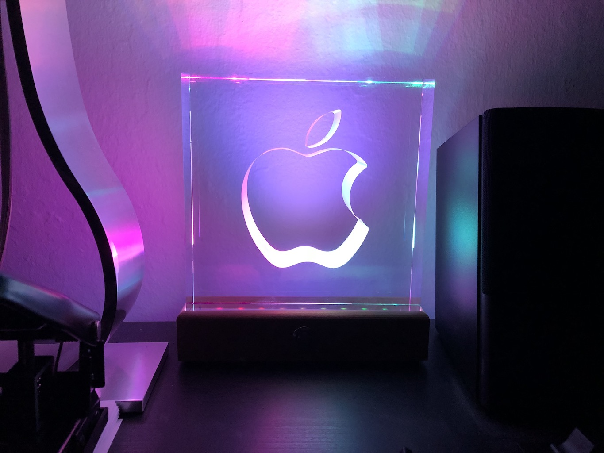

# Apple Service Award LED Stand

Files to create for a LED stand for Apple's 10 year service award

Designed to run on an ATtiny85. Code based off Adafruit [NeoPixel example code](https://github.com/adafruit/Adafruit_NeoPixel).

## Features

- Illuminated function button
- Single press for multiple light animations
- Press and hold for sleep mode (complete with 'pulsing' switch)

## Materials

- Attiny85
- Individually addressable LED strip (5V)
- 5V 2A power supply [5.5 mm * 2.1 mm] barrel jack
- [5.5 mm * 2.1 mm] panel mount barrel jack
- ATI 16mm Momentary White LED 2.8V 4.3V Push Button 